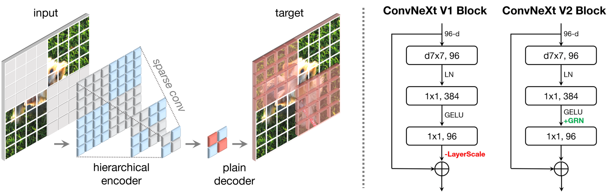
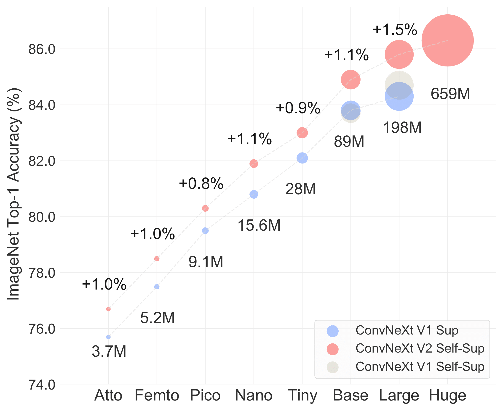

## ConvNeXt V2<br><sub>Official PyTorch Implementation</sub>

This repo contains the PyTorch version of *8* model definitions (*Atto, Femto, Pico, Nano, Tiny, Base, Large, Huge*), pre-training/fine-tuning code and pre-trained weights (converted from JAX weights trained on TPU) for our ConvNeXt V2 paper.

> [**ConvNeXt V2: Co-designing and Scaling ConvNets with Masked Autoencoders**](http://arxiv.org/abs/2301.00808)<br>
> [Sanghyun Woo](https://sites.google.com/view/sanghyunwoo/), [Shoubhik Debnath](https://www.linkedin.com/in/shoubhik-debnath-41268570/), [Ronghang Hu](https://ronghanghu.com/), [Xinlei Chen](https://xinleic.xyz/), [Zhuang Liu](https://liuzhuang13.github.io/), [In So Kweon](https://scholar.google.com/citations?user=XA8EOlEAAAAJ&hl=en) and [Saining Xie](https://sainingxie.com)\
> <br>KAIST, Meta AI and New York University<br>

We propose a fully convolutional masked autoencoder framework (FCMAE) and a new Global Response Normalization (GRN) layer that can be added to the ConvNeXt architecture to enhance inter-channel feature competition. This co-design of self-supervised learning techniques and architectural improvement results in a new model family called ConvNeXt V2, which significantly improves the performance of pure ConvNets on various recognition benchmarks. We also provide pre-trained ConvNeXt V2 models of various sizes.

<p align="center">

</p>

<p align="center">

</p>

## Results and Pre-trained Models
### ImageNet-1K FCMAE pre-trained weights (*self-supervised*)
| name | resolution | #params | model |
|:---:|:---:|:---:|:---:|
| ConvNeXt V2-A | 224x224 | 3.7M | [model](https://dl.fbaipublicfiles.com/convnext/convnextv2/pt_only/convnextv2_atto_1k_224_fcmae.pt) |
| ConvNeXt V2-F | 224x224 | 5.2M | [model](https://dl.fbaipublicfiles.com/convnext/convnextv2/pt_only/convnextv2_femto_1k_224_fcmae.pt) |
| ConvNeXt V2-P | 224x224 | 9.1M | [model](https://dl.fbaipublicfiles.com/convnext/convnextv2/pt_only/convnextv2_pico_1k_224_fcmae.pt) |
| ConvNeXt V2-N | 224x224 | 15.6M| [model](https://dl.fbaipublicfiles.com/convnext/convnextv2/pt_only/convnextv2_nano_1k_224_fcmae.pt) |
| ConvNeXt V2-T | 224x224 | 28.6M| [model](https://dl.fbaipublicfiles.com/convnext/convnextv2/pt_only/convnextv2_tiny_1k_224_fcmae.pt) |
| ConvNeXt V2-B | 224x224 | 89M  | [model](https://dl.fbaipublicfiles.com/convnext/convnextv2/pt_only/convnextv2_base_1k_224_fcmae.pt) |
| ConvNeXt V2-L | 224x224 | 198M | [model](https://dl.fbaipublicfiles.com/convnext/convnextv2/pt_only/convnextv2_large_1k_224_fcmae.pt) |
| ConvNeXt V2-H | 224x224 | 660M | [model](https://dl.fbaipublicfiles.com/convnext/convnextv2/pt_only/convnextv2_huge_1k_224_fcmae.pt) |

### ImageNet-1K fine-tuned models

| name | resolution |acc@1 | #params | FLOPs | model |
|:---:|:---:|:---:|:---:| :---:|:---:|
| ConvNeXt V2-A | 224x224 | 76.7 | 3.7M  | 0.55G | [model](https://dl.fbaipublicfiles.com/convnext/convnextv2/im1k/convnextv2_atto_1k_224_ema.pt) |
| ConvNeXt V2-F | 224x224 | 78.5 | 5.2M  | 0.78G | [model](https://dl.fbaipublicfiles.com/convnext/convnextv2/im1k/convnextv2_femto_1k_224_ema.pt) |
| ConvNeXt V2-P | 224x224 | 80.3 | 9.1M  | 1.37G | [model](https://dl.fbaipublicfiles.com/convnext/convnextv2/im1k/convnextv2_pico_1k_224_ema.pt) |
| ConvNeXt V2-N | 224x224 | 81.9 | 15.6M | 2.45G | [model](https://dl.fbaipublicfiles.com/convnext/convnextv2/im1k/convnextv2_nano_1k_224_ema.pt) |
| ConvNeXt V2-T | 224x224 | 83.0 | 28.6M | 4.47G | [model](https://dl.fbaipublicfiles.com/convnext/convnextv2/im1k/convnextv2_tiny_1k_224_ema.pt) |
| ConvNeXt V2-B | 224x224 | 84.9 | 89M   | 15.4G | [model](https://dl.fbaipublicfiles.com/convnext/convnextv2/im1k/convnextv2_base_1k_224_ema.pt) |
| ConvNeXt V2-L | 224x224 | 85.8 | 198M  | 34.4G | [model](https://dl.fbaipublicfiles.com/convnext/convnextv2/im1k/convnextv2_large_1k_224_ema.pt) |
| ConvNeXt V2-H | 224x224 | 86.3 | 660M  | 115G  | [model](https://dl.fbaipublicfiles.com/convnext/convnextv2/im1k/convnextv2_huge_1k_224_ema.pt) |

### ImageNet-22K fine-tuned models

| name | resolution |acc@1 | #params | FLOPs | model |
|:---:|:---:|:---:|:---:| :---:| :---:|
| ConvNeXt V2-N | 224x224 | 82.1 | 15.6M | 2.45G   | [model](https://dl.fbaipublicfiles.com/convnext/convnextv2/im22k/convnextv2_nano_22k_224_ema.pt)|
| ConvNeXt V2-N | 384x384 | 83.4 | 15.6M | 7.21G   | [model](https://dl.fbaipublicfiles.com/convnext/convnextv2/im22k/convnextv2_nano_22k_384_ema.pt)|
| ConvNeXt V2-T | 224x224 | 83.9 | 28.6M | 4.47G   | [model](https://dl.fbaipublicfiles.com/convnext/convnextv2/im22k/convnextv2_tiny_22k_224_ema.pt)|
| ConvNeXt V2-T | 384x384 | 85.1 | 28.6M | 13.1G  | [model](https://dl.fbaipublicfiles.com/convnext/convnextv2/im22k/convnextv2_tiny_22k_384_ema.pt)|
| ConvNeXt V2-B | 224x224 | 86.8 | 89M   | 15.4G   | [model](https://dl.fbaipublicfiles.com/convnext/convnextv2/im22k/convnextv2_base_22k_224_ema.pt)|
| ConvNeXt V2-B | 384x384 | 87.7 | 89M   | 45.2G  | [model](https://dl.fbaipublicfiles.com/convnext/convnextv2/im22k/convnextv2_base_22k_384_ema.pt)|
| ConvNeXt V2-L | 224x224 | 87.3 | 198M  | 34.4G   | [model](https://dl.fbaipublicfiles.com/convnext/convnextv2/im22k/convnextv2_large_22k_224_ema.pt)|
| ConvNeXt V2-L | 384x384 | 88.2 | 198M  | 101.1G  | [model](https://dl.fbaipublicfiles.com/convnext/convnextv2/im22k/convnextv2_large_22k_384_ema.pt)|
| ConvNeXt V2-H | 384x384 | 88.7 | 660M  | 337.9G  | [model](https://dl.fbaipublicfiles.com/convnext/convnextv2/im22k/convnextv2_huge_22k_384_ema.pt)|
| ConvNeXt V2-H | 512x512 | 88.9 | 660M  | 600.8G  | [model](https://dl.fbaipublicfiles.com/convnext/convnextv2/im22k/convnextv2_huge_22k_512_ema.pt)|

## Installation
Please check [INSTALL.md](INSTALL.md) for installation instructions. 

## Evaluation
We provide example evaluation commands for ConvNeXt V2-Base:

Single-GPU
```
python main_finetune.py \
--model convnextv2_base \
--eval true \
--resume /path/to/checkpoint \
--input_size 224 \
--data_path /path/to/imagenet-1k \
```
Multi-GPU
```
python -m torch.distributed.launch --nproc_per_node=8 main_finetune.py \
--model convnextv2_base \
--eval true \
--resume /path/to/checkpoint \
--input_size 224 \
--data_path /path/to/imagenet-1k \
```

- For evaluating other model variants, change `--model`, `--resume`, `--input_size` accordingly. URLs for the pre-trained models can be found from the result tables. 
- Setting model-specific `--drop_path` is not strictly required in evaluation, as the `DropPath` module in timm behaves the same during evaluation; but it is required in training. See [TRAINING.md](TRAINING.md) or our paper (appendix) for the values used for different models.

## Training
See [TRAINING.md](TRAINING.md) for pre-training and fine-tuning instructions.

## Acknowledgement
This repository borrows from [timm](https://github.com/rwightman/pytorch-image-models), [ConvNeXt](https://github.com/facebookresearch/ConvNeXt) and [MAE](https://github.com/facebookresearch/mae).

We thank Ross Wightman for the initial design of the small-compute ConvNeXt model variants and the associated training recipe. We also appreciate the helpful discussions and feedback provided by Kaiming He.

## License
This project is released under the MIT license except ImageNet pre-trained and fine-tuned models which are licensed under a CC-BY-NC. Please see the [LICENSE](LICENSE) file for more information.

## Citation
If you find this repository helpful, please consider citing:
```bibtex
@article{Woo2023ConvNeXtV2,
  title={ConvNeXt V2: Co-designing and Scaling ConvNets with Masked Autoencoders},
  author={Sanghyun Woo, Shoubhik Debnath, Ronghang Hu, Xinlei Chen, Zhuang Liu, In So Kweon and Saining Xie},
  year={2023},
  journal={arXiv preprint arXiv:2301.00808},
}
```
